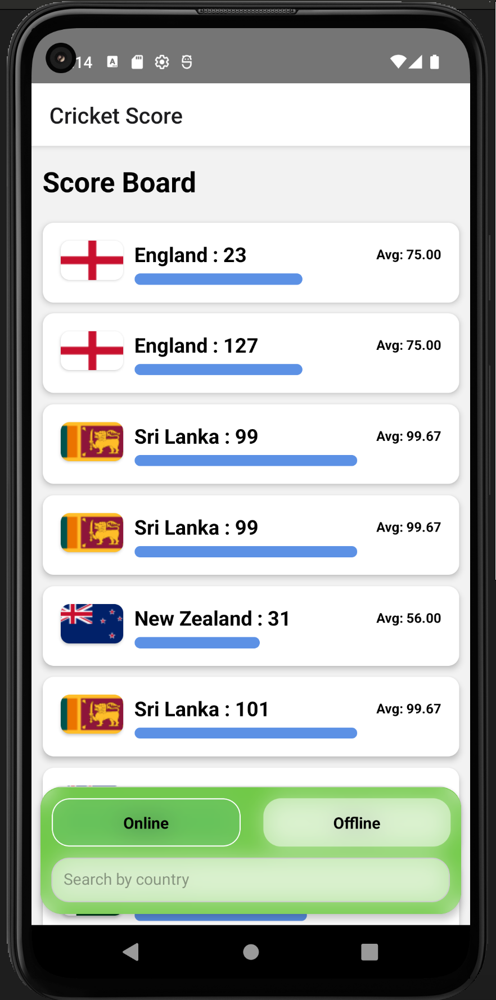
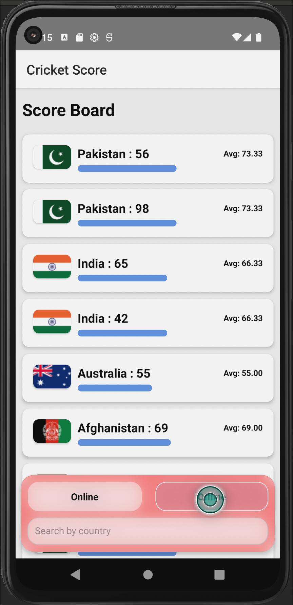
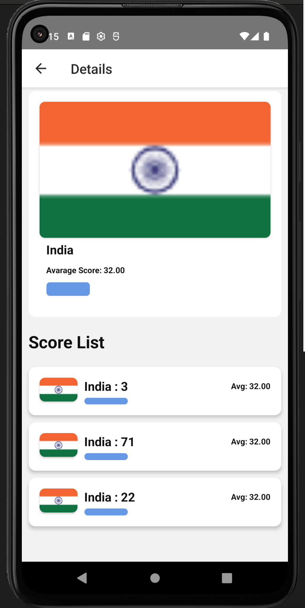

# CricketScore App

<div style="display: flex; justify-content: space-around; align-items: center;">





</div>

## Overview

The **CricketScore** app is a dynamic, responsive React Native application that displays cricket scores of a batsman against various countries. It calculates the average score against each country and represents it visually with a blue bar whose width is proportional to the average score. The app demonstrates features like dynamic data binding, responsive design, and automatic updates based on user interaction.

---

## Features

### Dynamic Data Binding

- **Test Data Mode**: The app includes a hardcoded JSON string with test data for immediate testing.
- **Server Data Mode**: Fetches dynamic data from the server endpoint: `https://assessments.reliscore.com/api/cric-scores/`.
- **Data Format**:
  ```json
  [
    ["Pakistan", 23],
    ["Pakistan", 127],
    ["India", 3],
    ["India", 71],
    ["Australia", 31],
    ["India", 22],
    ["Pakistan", 81]
  ]
  ```

### Automatic Updates

- Displays the average score dynamically as the user types the name of a country.
- If the input does not match a country in the data, a `-` is displayed and the blue bar is hidden.
- When a valid country name is entered, the correct average score is displayed and the blue bar is shown with a width of `2 * X` pixels, where `X` is the average score.

### Responsive Design

- Each row consists of three parts:
  1. The country name
  2. The calculated average score
  3. A blue horizontal bar representing the average score visually
- The app is designed to work seamlessly on both Android and iOS devices.

---

## Setup Instructions

1. **Prerequisites**:

   - Node.js installed (v14.x or later).
   - React Native CLI installed.
   - Android Studio or Xcode for running the app on emulators.

2. **Download The ZIP File**:

   ```bash
   Download the .zip file
   Extract the file
   Open the Project folder in a IDE
   ```

3. **Install Dependencies**:

   ```bash
   npm install
   ```

4. **Run the App**:

   - For Android:
     ```bash
     npx react-native run-android
     ```
   - For iOS:
     ```bash
     npx react-native run-ios
     ```

---

## How the App Works

1. **Modes**:

   - The app has two modes: `Test Data` and `Server Data`.
   - Switching modes updates the data source dynamically without restarting the app.

2. **Input Behavior**:

   - Start typing a country name in the input box.
   - If the name matches a country in the data, the average score and blue bar are updated.
   - If there is no match, a `-` is displayed and the bar remains hidden.

3. **Data Processing**:

   - The app calculates the average score for each country dynamically using the available data.
   - For `Server Data`, data is fetched using `fetch` API, and appropriate error handling is implemented.

---

## Dependencies

### Core Dependencies:

- **"react": "18.3.1"** - The React framework for building the app.
- **"react-native": "0.76.5"** - The React Native framework for cross-platform app development.

### State Management:

- **"@reduxjs/toolkit": "^1.6.2"** - Toolkit for managing application state.
- **"react-redux": "^7.2.6"** - Integrates Redux with React.
- **"redux-persist": "^6.0.0"** - Persistence layer for Redux state.
- **"redux-logger": "^3.0.6"** - Middleware for logging Redux actions and state changes.
- **"redux-saga": "^1.1.3"** - Middleware for managing side effects in Redux.

### Navigation:

- **"@react-navigation/native": "^7.0.14"** - Core library for navigation.
- **"@react-navigation/native-stack": "^7.2.0"** - Stack navigation for screens.
- **"@react-navigation/stack": "^7.1.0"** - Stack-based navigator.

### Networking:

- **"axios": "^0.24.0"** - For fetching data from APIs.

### Utilities:

- **"react-native-vector-icons": "^10.2.0"** - Icons for React Native.
- **"react-native-safe-area-context": "^5.0.0"** - Handles safe area insets.
- **"react-native-reanimated": "^3.16.5"** - Animations for React Native.
- **"@react-native-community/blur": "^4.4.1"** - Adding blur effects.
- **"react-native-gesture-handler": "^2.21.2"** - Gesture handling for navigation and UI.
- **"react-native-country-flag": "^2.0.2"** - Displays country flags.

---

## Status

### What Works

- Dynamic data binding using both test data and server data.
- Automatic updates of average scores and bar width based on user input.

### Known Issues

- N/A (Fully functional as per requirements).

---

## Notes

- Ensure the server endpoint `https://assessments.reliscore.com/api/cric-scores/` is accessible for `Server Data` mode to function correctly.
- Update `package.json` and run `npm install` if you add new dependencies.
- Any improvements or fixes can be added as additional commits to the repository.

---

## Contact

For questions or feedback, please contact paulsouraj99@gmail.com.
